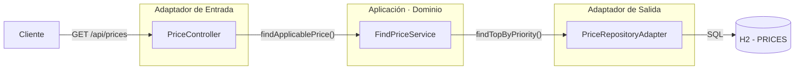

# Inditex Prices REST Service

---

## Tecnologías


| Herramienta       | Versión | Uso                              |
| ----------------- | ------- | -------------------------------- |
| Java              | 17      | Lenguaje principal               |
| Spring Boot       | 3.4.4   | Framework base                   |
| Spring Data JPA   |         | Acceso a datos                   |
| H2                |         | Base de datos en memoria         |
| Lombok            |         | Reducción de boilerplate         |
| SpringDoc OpenAPI |         | Documentación Swagger automática |
| JUnit 5 + Mockito |         | Tests unitarios e integración    |


---

## Arquitectura

El proyecto sigue la **Arquitectura Hexagonal**. La idea central es que el dominio —la lógica de negocio— está completamente aislado del resto. Todo lo que necesita del exterior lo define como una interfaz (puerto), y la infraestructura se encarga de implementarla (adaptador).

Esto hace que el núcleo del sistema sea testeable de forma independiente y fácil de mantener ante cambios tecnológicos.

### Diagrama de capas



## API

### Endpoint

```
GET /api/prices
```

### Parámetros


| Parámetro   | Tipo            | Formato               | Descripción                |
| ----------- | --------------- | --------------------- | -------------------------- |
| `date`      | `LocalDateTime` | `yyyy-MM-ddTHH:mm:ss` | Fecha y hora de consulta   |
| `productId` | `Long`          | número positivo       | Identificador del producto |
| `brandId`   | `Long`          | número positivo       | Identificador de la marca  |


### Respuesta exitosa `200 OK`

```json
{
  "productId": 35455,
  "brandId": 1,
  "priceList": 2,
  "startDate": "2020-06-14T15:00:00",
  "endDate": "2020-06-14T18:30:00",
  "amount": 25.45,
  "currency": "EUR"
}
```

### Respuestas de error


| Código            | Motivo                                    |
| ----------------- | ----------------------------------------- |
| `400 Bad Request` | Parámetros inválidos o ausentes           |
| `404 Not Found`   | No existe precio para la combinación dada |


### Ejemplos de uso

```bash
# Precio el 14 de junio a las 10:00
curl "http://localhost:8080/api/prices?date=2020-06-14T10:00:00&productId=35455&brandId=1"

# Precio el 14 de junio a las 16:00 (tarifa promocional en vigor)
curl "http://localhost:8080/api/prices?date=2020-06-14T16:00:00&productId=35455&brandId=1"

# Precio el 15 de junio a las 10:00
curl "http://localhost:8080/api/prices?date=2020-06-15T10:00:00&productId=35455&brandId=1"
```

---

## Regla de negocio: resolución de prioridad

La tabla `PRICES` puede contener varias tarifas activas simultáneamente para el mismo producto y marca. El campo `PRIORITY` determina cuál prevalece: **a mayor valor, mayor prioridad**.

La consulta a base de datos resuelve esto directamente con una sola query ordenada:

```sql
SELECT p FROM PriceEntity p
WHERE p.productId = :productId
  AND p.brandId   = :brandId
  AND :date BETWEEN p.startDate AND p.endDate
ORDER BY p.priority DESC
LIMIT 1
```

También se creó un índice compuesto sobre `(PRODUCT_ID, BRAND_ID, START_DATE, END_DATE)` para optimizar esta consulta, que siempre filtra por esas cuatro columnas.

---

## Ejecución local

### Requisitos

- Java 17+
- Maven 3.8+

### Arrancar la aplicación

```bash
mvn spring-boot:run -Dspring-boot.run.profiles=dev
```

La aplicación arranca en `http://localhost:8080`.

Con el perfil `dev` activo, la consola de H2 está disponible en:
`http://localhost:8080/h2-console` (JDBC URL: `jdbc:h2:mem:pricesdb`)

### Documentación interactiva (Swagger UI)

```
http://localhost:8080/swagger-ui.html
```

---

## Tests

El proyecto tiene tres niveles de pruebas:


| Tipo        | Clase                  | Descripción                                                        |
| ----------- | ---------------------- | ------------------------------------------------------------------ |
| Unitario    | `FindPriceServiceTest` | Verifica la lógica de negocio aislada, sin Spring ni base de datos |
| Integración | `PriceControllerTest`  | Prueba la capa HTTP con MockMvc sobre contexto Spring completo     |
| E2E         | `PriceE2ETest`         | Arranca el servidor completo y lanza peticiones HTTP reales        |


### Ejecutar todos los tests

```bash
mvn test
```

### Ejecutar solo los tests E2E

```bash
mvn test -Dtest=PriceE2ETest
```

